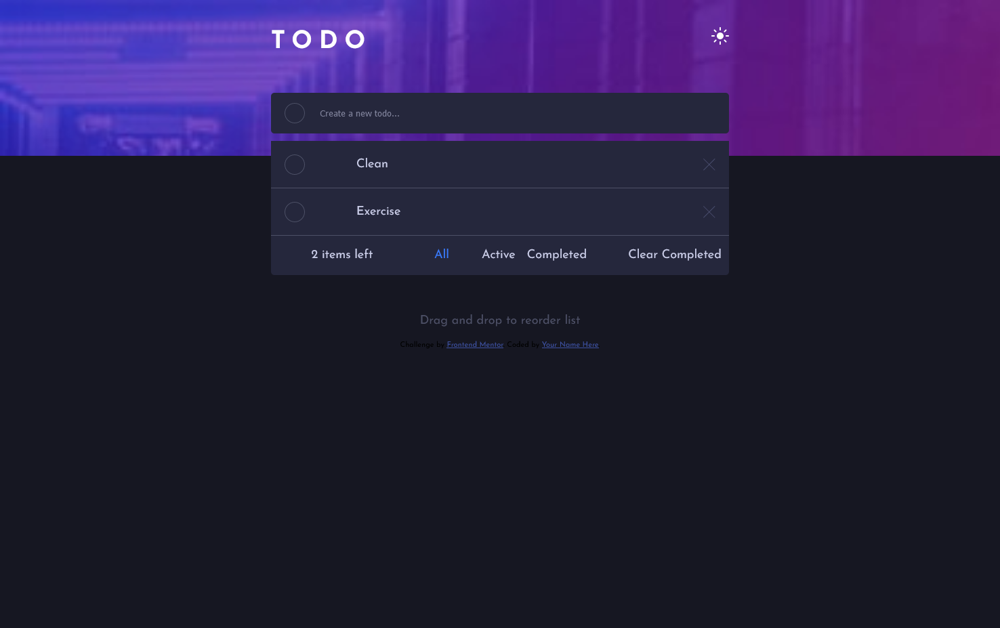

# Frontend Mentor - Todo app solution

This is a solution to the [Todo app challenge on Frontend Mentor](https://www.frontendmentor.io/challenges/todo-app-Su1_KokOW). Frontend Mentor challenges help you improve your coding skills by building realistic projects.

## Table of contents

- [Overview](#overview)
  - [The challenge](#the-challenge)
  - [Screenshot](#screenshot)
  - [Links](#links)
- [My process](#my-process)
  - [Built with](#built-with)
  - [What I learned](#what-i-learned)
  - [Continued development](#continued-development)
  - [Useful resources](#useful-resources)
- [Author](#author)

## Overview

### The challenge

Users should be able to:

- View the optimal layout for the app depending on their device's screen size
- See hover states for all interactive elements on the page
- Add new todos to the list
- Mark todos as complete
- Delete todos from the list
- Filter by all/active/complete todos
- Clear all completed todos
- Toggle light and dark mode
- **Bonus**: Drag and drop to reorder items on the list

### Screenshot

### Links

- Solution URL: [Github](https://github.com/vikiorf/Todo-frontend-mentor)
- Live Site URL: [Live Site](https://todo-frontend-mentor-blush.vercel.app/)

## My process

### Built with

- Semantic HTML5 markup
- CSS custom properties
- Flexbox
- CSS Grid
- Mobile-first workflow
- JavaScript

### What I learned

Learned how to create drag and drop-function in js. Really fun to do.

### Continued development

I still need to work on my CSS and make my code cleaner in general.

### Useful resources

- [Drag and drop](https://webdevtrick.com/html-drag-and-drop-list/) - This helped me whit the drag and drop feature, would recommend for anyone who doesn't know how to drag and drop.

## Author

- Frontend Mentor - [@vikiorf](https://www.frontendmentor.io/profile/vikiorf)
